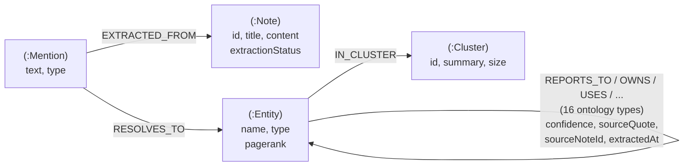

# Neo4j Data Model

Target model for moving Brahmastra's graph off SQLite and onto a shared,
network-reachable property graph (Neo4j Aura), so several machines read and
write one graph.

Derived from the live schema in `backend/brahmastra/db.py` and the ontology in
`backend/brahmastra/ontology.py` (**16 relations, 12 entity types, 4 of them
functional**), not from a generic template.

---

## 1. Goals and non-goals

**Goals**

- One shared graph, reachable over the network from more than one machine.
- Make GraphRAG retrieval a real traversal. Today `rag.py` loads the entire
  serialised graph and linear-scans every edge in Python (`_subgraph_facts`).
- Keep full provenance: every fact traces to a note, a quote and a confidence.
- Preserve entity-resolution auditability (the "merge proofs" the UI shows).

**Non-goals**

- Moving PageRank/Louvain into the database. Neo4j's Graph Data Science library
  is a separate product and is not on the free Aura tier; NetworkX keeps
  computing them and we write the scores back as properties.
- Chasing performance. At 191 nodes / 239 edges, in-memory NetworkX beats any
  network round-trip. This is a bet on capability and sharing, not speed.

---

## 2. The model



### Nodes

| Label | Key | Properties | Maps from |
|---|---|---|---|
| `:Note` | `id` | `title`, `content`, `lastEdited`, `lastSynced`, `extractionStatus` | `notes` table |
| `:Mention` | `text` | `type` (entity type as extracted) | `raw_triples.subject_text` / `object_text`, `canonical_map.mention_text` |
| `:Entity` | `name` | `type`, `pagerank`, `clusterId` | `entity_clusters.canonical_name` |
| `:Cluster` | `id` | `summary`, `size`, `builtAt` | Louvain output + `cluster_summary.py` |

`:Entity` also carries its ontology type as a **secondary label** — `:Entity:Person`,
`:Entity:Project`. The shared `:Entity` label keeps cross-type queries simple while
the specific label gives index-backed scans. A common supertype label plus a
specific one is standard Neo4j practice.

### Relationships

| Type | From → To | Properties |
|---|---|---|
| 16 ontology relations: `REPORTS_TO`, `OWNS`, `WORKS_ON`, `DEPENDS_ON`, `USES`, `PART_OF`, `HAS_COMPONENT`, `IMPLEMENTS`, `PROVIDES`, `INTEGRATES_WITH`, `CREATED_BY`, `HAS_STATUS`, `SCHEDULED_FOR`, `LOCATED_IN`, `BLOCKS`, `RELATED_TO` | `:Entity` → `:Entity` | `confidence`, `sourceQuote`, `sourceNoteId`, `extractedAt` |
| `RESOLVES_TO` | `:Mention` → `:Entity` | `method`, `score` (the merge proof) |
| `EXTRACTED_FROM` | `:Mention` → `:Note` | — |
| `IN_CLUSTER` | `:Entity` → `:Cluster` | — |

---

## 3. Two decisions worth defending

### 3.1 Direct relationships, not reified `(:Fact)` nodes

Each extracted triple becomes one relationship carrying its own provenance. Two
notes asserting "Sarah reports_to Mei" produce two parallel relationships.

Rejected the RDF-style reification — `(:Entity)-[:SUBJECT]->(:Fact)-[:OBJECT]->(:Entity)` —
because reification exists to work around RDF's inability to put properties on an
edge. A labelled property graph has that natively, so reifying would triple the
node count and turn every 1-hop question into a 2-hop one for no gain. It also
matches the existing `nx.MultiDiGraph`, which already permits parallel edges.

Reification becomes worth revisiting only if we need statements *about*
statements ("Raj disputes this fact"), which nothing in the product needs today.

### 3.2 Real relationship types, not `[:RELATED {relation: "..."}]`

Using the ontology relation as the actual Neo4j type makes traversal
type-indexed and Cypher readable. The cost is that relationship types cannot be
parameterised in Cypher, so the type must be interpolated into the query string.

This is safe **only** because the ontology is a closed set validated by
`is_valid_triple()`. Every write must map through `RELATION_NAMES`; anything
unrecognised is rejected before it reaches Cypher. That check is the injection
boundary and must not be skipped.

### 3.3 Mentions stay as nodes

Keeping `:Mention` separate from `:Entity` preserves the entity-resolution audit
trail the dashboard already exposes ("raw mentions → canonical mapping with merge
proofs"). Collapsing mentions into a property array would make that panel
unimplementable and lose the per-mention provenance path
`Mention → EXTRACTED_FROM → Note`.

---

## 4. Constraints and indexes

```cypher
// Identity — uniqueness constraints also create backing indexes.
CREATE CONSTRAINT note_id      IF NOT EXISTS FOR (n:Note)    REQUIRE n.id   IS UNIQUE;
CREATE CONSTRAINT entity_name  IF NOT EXISTS FOR (e:Entity)  REQUIRE e.name IS UNIQUE;
CREATE CONSTRAINT mention_text IF NOT EXISTS FOR (m:Mention) REQUIRE m.text IS UNIQUE;
CREATE CONSTRAINT cluster_id   IF NOT EXISTS FOR (c:Cluster) REQUIRE c.id   IS UNIQUE;

// Full-text — replaces the LIKE scan in db.search_notes().
CREATE FULLTEXT INDEX noteSearch IF NOT EXISTS
  FOR (n:Note) ON EACH [n.title, n.content];

// Ranking + filtering.
CREATE INDEX entity_pagerank IF NOT EXISTS FOR (e:Entity) ON (e.pagerank);
CREATE INDEX note_status     IF NOT EXISTS FOR (n:Note)   ON (n.extractionStatus);
```

`note_status` matters: the extract stage selects on `extractionStatus`, and that
predicate runs on every incremental pipeline run.

---

## 5. Migration map from SQLite

| SQLite | Neo4j | Note |
|---|---|---|
| `notes` | `(:Note)` | 1:1 |
| `raw_triples` | typed `:Entity`→`:Entity` relationships | provenance columns become relationship properties |
| `canonical_map` | `(:Mention)-[:RESOLVES_TO]->(:Entity)` | |
| `entity_clusters` | `(:Entity)` + `all_mentions` via `RESOLVES_TO` | JSON array becomes real edges |
| `graph_cache` | **dropped** | the store *is* the graph; no serialise/deserialise step |

Dropping `graph_cache` is the structural win. Today the pipeline computes a
graph, serialises it to a single JSON row, and every reader parses it back.

---

## 6. What the model buys

**Today** — `rag.py` local search loads the whole graph and filters in Python:

```python
cached = db.get_cached_graph()          # entire graph
edges  = cached["graph"]["edges"]
facts  = _subgraph_facts(entity_ids, edges)   # linear scan of every edge
```

**After** — one indexed traversal:

```cypher
MATCH (e:Entity)-[r]-(n:Entity)
WHERE e.name IN $names
RETURN e.name, type(r) AS relation, n.name,
       r.confidence, r.sourceQuote, r.sourceNoteId
ORDER BY r.confidence DESC
```

Newly possible — multi-hop, which the current design cannot express at all:

```cypher
// "Who does Sarah's manager also manage?"
MATCH (:Entity {name: "Sarah"})-[:REPORTS_TO]->(mgr)<-[:REPORTS_TO]-(peer)
RETURN peer.name
```

Contradiction detection becomes a pattern match over the 4 functional relations
(`reports_to`, `has_status`, `scheduled_for`, `located_in`) — functional means at
most one value, so more than one is by definition a conflict:

```cypher
MATCH (e:Entity)-[r:LOCATED_IN]->(v)
WITH e, collect(DISTINCT v.name) AS values, collect(r) AS rels
WHERE size(values) > 1
RETURN e.name, values, [x IN rels | x.sourceNoteId] AS sources
```

---

## 7. Standards conformance

| Standard | How this model conforms |
|---|---|
| **Labelled Property Graph** (Neo4j's model) | Entities are nodes, relations are typed edges, provenance lives as edge properties — no reification workaround |
| **Neo4j naming conventions** | `PascalCase` labels, `UPPER_SNAKE_CASE` relationship types, `camelCase` properties. This is why `source_note_id` becomes `sourceNoteId` |
| **RDF / triple model** | The `subject–predicate–object` shape from extraction maps 1:1 onto `(:Entity)-[:REL]->(:Entity)`; the ontology is the controlled vocabulary |
| **W3C PROV-O** | `EXTRACTED_FROM` is a domain alias of `prov:wasDerivedFrom`; `sourceQuote` + `extractedAt` + `confidence` carry the generation evidence |
| **Neo4j modelling guidance** | Nodes are nouns, relationships are verbs; a supertype label (`:Entity`) plus a specific label (`:Person`); uniqueness constraints on every node key |

Deliberate divergence: PROV-O models provenance as first-class `prov:Activity`
nodes. We keep it as edge properties instead — full `prov:Activity` reification
would impose the same 2-hop cost rejected in §3.1, for provenance detail the
product does not query independently.

---

## 8. Open items before implementation

1. **Verify current Aura free-tier limits** (node/relationship caps, idle-pause
   behaviour) at setup time rather than trusting any figure written here.
2. **Write-back of computed scores.** NetworkX still computes `pagerank` and
   cluster assignment; decide whether that is one batched `UNWIND` per run
   (simple, and fine at this scale) or a diff.
3. **Relation → type casing.** `reports_to` → `REPORTS_TO` is mechanical, but the
   mapping belongs in `ontology.py` as one function used by every writer, so the
   injection boundary in §3.2 has exactly one implementation.
